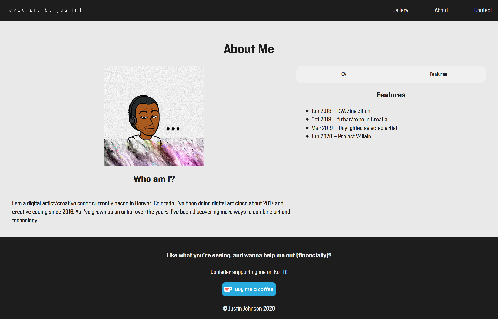
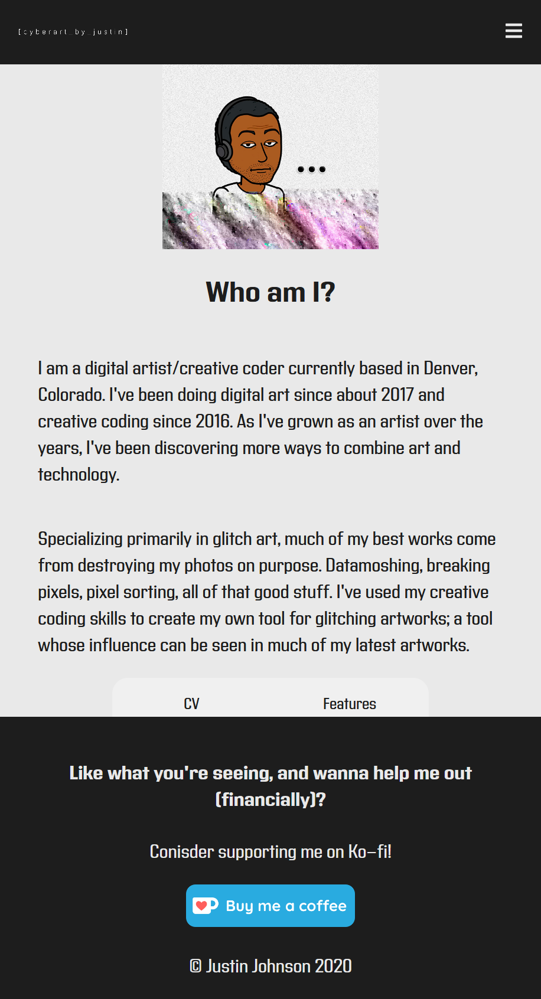
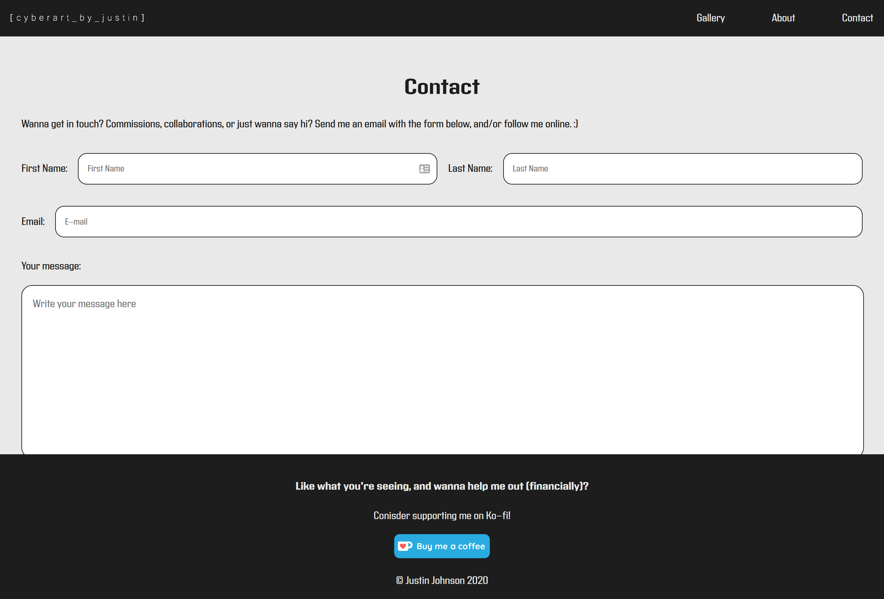
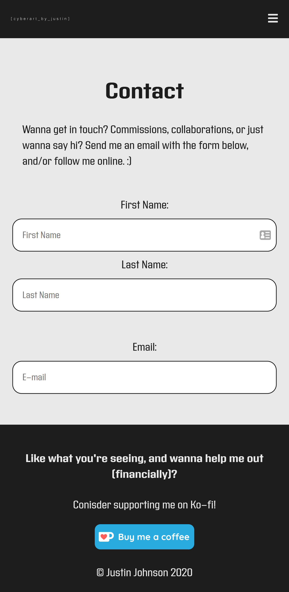

<h1>Portfolio Concept (Work In Progress)</h1>

A conceptual design for a potential portfolio website using React, along SCSS and BEM methodologies. Includes a responsive design for mobile devices.

<strong>This was a project I originally started in June 2020 while learning React on my own. Ever since the start of my software developer apprenticeship, I am in the process of refactoring the source code in tandem with the topics covered.</strong>

This may eventually be pushed to become an actual website depending on the amount of progress made!

<section>
    <h2>Screenshots</h2>
    <article>
        About page
        

        
        
        

    </article>
    <article>
        Contact page
        

        
        
        

    </article>
</section>
